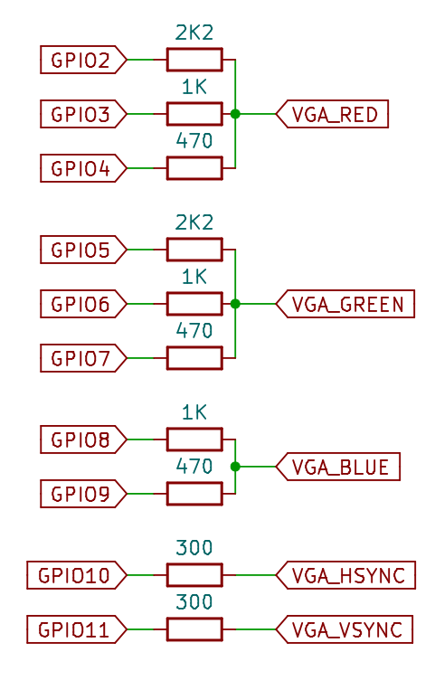
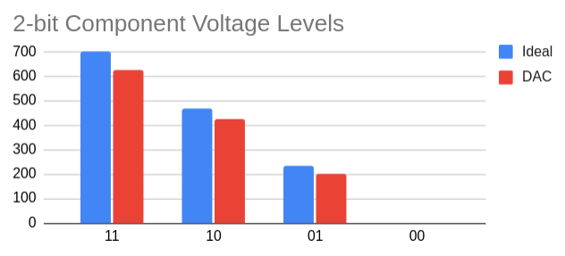
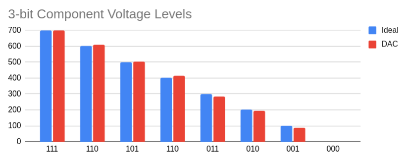
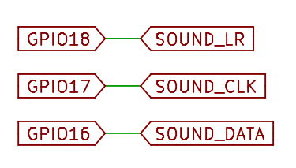
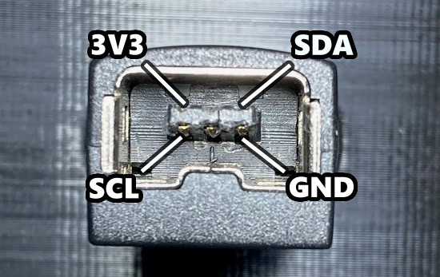
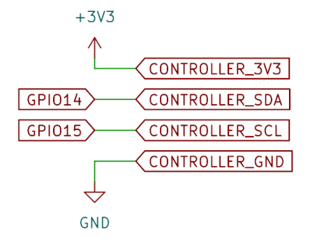
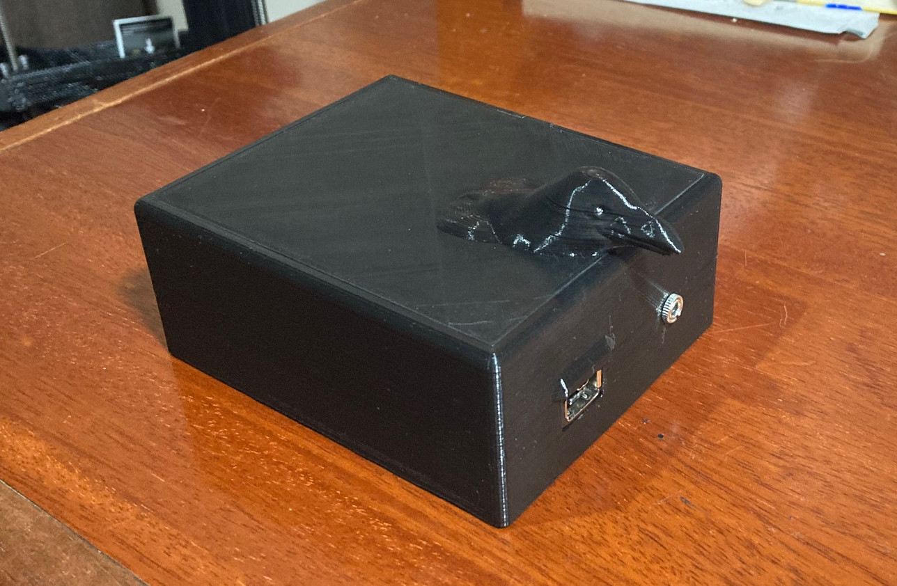
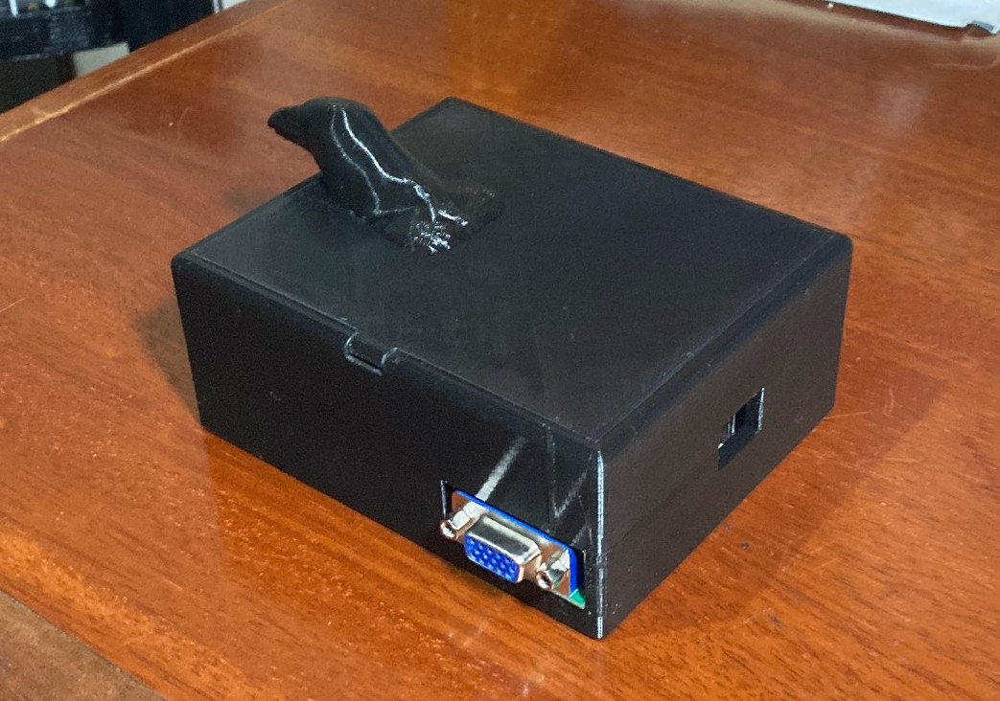
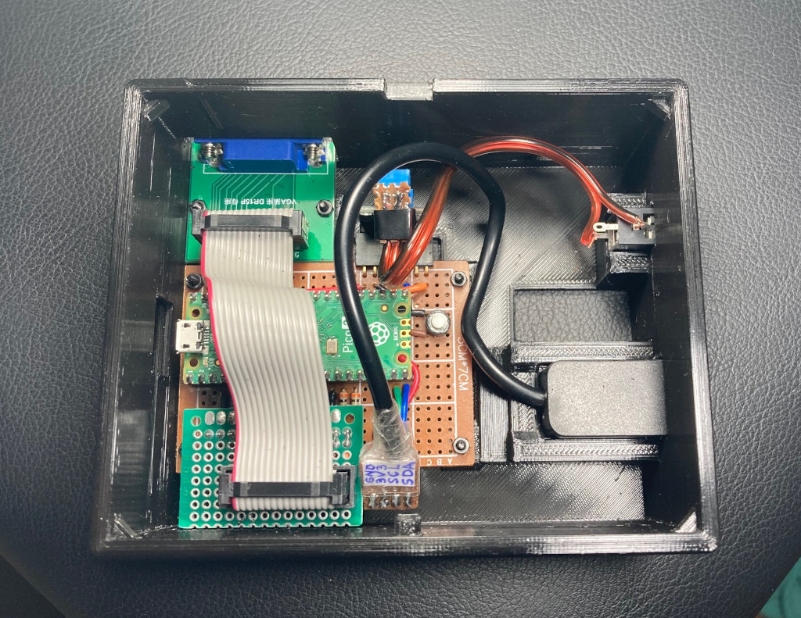
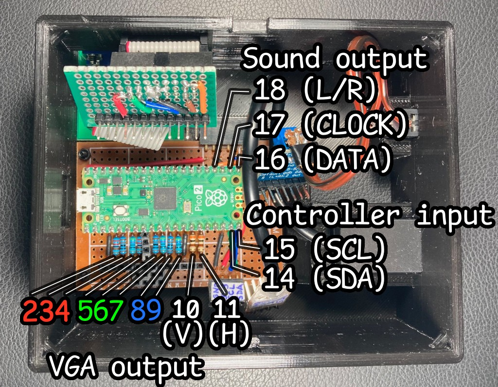

# pico-raven

***Pico Raven*** is a videogame system (game and console) being developed using the Raspberry Pi Pico 2. This document describes the technical aspects of the system.

Features:

- video: VGA 320x240 with 256 colors (RGB 3:3:2)
- sound: I2S with 16-bits mono with a MAX98357 amplifier
- controller: I2C with a Wii Classic controller
- console: sleek 3D-printed enclosure with miniature raven head (*wow*)

## Video

### Physical VGA Output

The VGA signal is output on GPIO pins 2 through 11. Pins 2-9 contain 8 color bits (RGB 3:3:2), pin 10 has the HSYNC signal and pin 11 the VSYNC.

We use a few simple resistor DACs to convert the color bits to VGA analog voltage levels, as shown in the schematic:

The `VGA_RED`, `VGA_GREEN` and `VGA_BLUE` outputs are analog signals from 0 (no color) to 700mV (full color), terminated by the monitor with a 75 Ω resistor to ground.

The resistors for our DACs (2.2KΩ/1KΩ/470Ω for red/green and 1KΩ/470Ω for blue) are chosen due to their standard values and the fact that they produce voltage levels not too far off from the ideal:

  
Above: 2-bit DAC levels (used for the blue component) shown in red, compared to the ideal levels shown in blue (vertical axis in mV).

  
Above: 3-bit DAC levels (used for the red and green components) shown in red, compared to the ideal levels shown in blue (vertical axis in mV).

### VGA Signal and Framebuffers

The VGA signal is generated by the RP2350 PIO+DMA completely independent from the CPU. The DMA raises an IRQ at the end of each frame to notify the CPU that the frame is done and the next frame will start after the vertical blank period (i.e. after about 1.43ms of the IRQ raising).

Our method uses two 320x240 8-bit framebuffers, which uses a lot of RAM (over 150KB!) but gives the game engine complete freedom over how to draw the screen. The CPU fills one of the framebuffers (the "back-buffer") while the PIO+DMA sends the other one (the "front-buffer") to the VGA output.

 When CPU is done preparing the back-buffer, it waits for the DMA IRQ indicating the current frame is done and then swaps the framebuffers: the back-buffer becomes the front-buffer and vice versa. The new front-buffer will eventually be sent to the VGA output (after the vblank period), but the CPU is immediatelly free to start drawing on the new back-buffer.

If the CPU takes too long preparing the back-buffer, the front-buffer will be automatically repeated (since no swap took place) with no ill effects other than reduced framerate for the game engine. This means the CPU can never mess up the VGA signal: this even allows us to stop both CPU cores at will when needed (e.g. writing to flash when saving the game).

## Sound

Sound is generated by the RP2350's PIO as I2S, and sent to an external amplifier  (currently an MAX98357) to output the analog signal that can be sent to headphones or small speakers.

### Sound Pin Connections

  
Above: GPIO pins 16-18 connections to the MAX98357 pins.

### Sound Engine

The sound engine runs at 22KHz using 16 bit samples. It mixes two types of sources: sound effects and MOD music. Each source can have 8- or 16-bit samples; 8-bit samples are converted to 16 bits during mixing.

Sound effects are just sample buffers in flash or RAM, mixed directly. The system supports 4 simultaneous effects, but this can easily be changed at compile-time; currently a conservative value is chosen to avoid problems but it will probably be increased as the project develops.

The music source is generated by a custom simple MOD player that supports old-school 4-channel MOD files with the a couple of tweaks:

- samples are allowed to be either 8-bits or 16-bits;

- we use MOD effect `E8` to send cues to the game engine to synchronize music and animations during cutscenes (effect `E8` is undefined in the original Amiga PROTracker, but a lot of players use it as the left/right pan command, which is useless for us since our output is mono).

## Controller

We use Wii Classic controllers, because cheap clones are available and they're simple to use since they speak I2C. The downside is that it takes almost 1ms to read their output.

I found that the easiest and most reliable way to connect to a Wii Classic controller is to use the female socket from an extension cord, cheaply available online.

### Controller Pin Connections

This image shows the pinout of a *female* Wii controller connector seen head-on: 

  

And this is the schematic of the Pico 2 connections:

## Console

The console case is a 3D printed box with a raven head (*wow*). We have the controller and sound plugs hanging out until we come up with a better solution:

  
Above: console front showing raven head (*wow*) and the controller and sound ports

  
Above: console back showing the VGA connector and the hole for the Pico 2 USB connector (for power and firmware updates)

  
Above: View of the console internal parts

  
Above: View of the perfboard with peripherals disconnected to show the GPIO pin connections

The Pico 2 board is mounted in a 50mm x 70mm perfboard via female socket headers. The connections are:

- VGA: the DAC resistors are soldered to the perfboard and connect to female socket headers that send the signal to the VGA connector through a ribbon cable.

- controller: the GPIO pins connect directly to a Wii classic controller jack taken from an extension cable.

- sound: the GPIO pins connect to a small MAX98357 I2S amplifier board, which connect to the sound jack.
